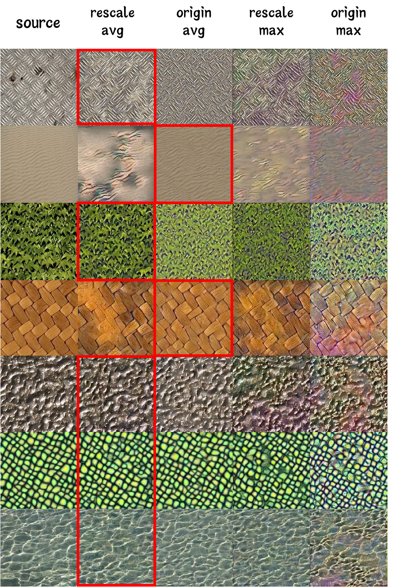

# Neural-Texture-Synthesis
This is a final team project for the Computer Vision course taught by Assistant Professor Pengshuai Wang in the fall term of 2023. The team memebers are Siyuan Yin, Shaoyang Cui, and Xiaohui Zhang.

The website of the tutorial is [Notion](https://fancy-icebreaker-99b.notion.site/Neural-Texture-Synthesis-fa7f4228679b49acb93836b3b6f45f6e)



## 1. Installation

The code has been tested on Windows 11 with python 3.9.12. 

1. create a virtual environment and activate it

```bash
conda create -n texture python=3.9
conda activate texture
```

2. install the required packages

```bash
pip install -r requirements.txt
```

3. Clone the repository

```bash
git clone https://github.com/Wanderings0/Neural-Texture-Synthesis.git
```

## 2. Usage

### 1. Model Definition

The model is defined in `VGG19.py`. The model is a VGG19 network with 16 convolutional layers and 5 pooling layers. The model is used to extract the feature maps of the input image and the style image. The feature maps are used to calculate the Gram matrix, which is used to calculate the MSE loss.

You can run the following code to see the model structure.

   ```bash
    python VGG19.py
   ```
    

 ### 2. Texture Synthesis

The texture synthesis is implemented in `texture_synthesis.py`. The file takes the following parameters:

| Argument            | Default Value                                  | Type  | Description                  |
|---------------------|------------------------------------------------|-------|------------------------------|
| `--model`           | `vgg19`                                        | `str` | model name                   |
| `--gt_path`         | `water.jpg`                                    | `str` | path to ground truth image   |
| `--pool`            | `max`                                          | `str` | pooling method               |
| `--rescale`         | `False`                                         | `bool` | rescale weights or not       |
| `--optimize`        | `Adam`                                         | `str` | optimize method              |
| `--epoch`           | `1000`                                         | `int` | epoch                        |
| `--lr`              | `0.05`                                         | `float` | learning rate               |
| `--device`          | `cuda:0`                                       | `str` | device                       |
| `--save_path`       | `result.jpg`                                   | `str` | save path                    |


You can run the following code to see the result of the texture synthesis. We provide two images for the ground truth image, `water.jpg` and `leaf.jpg`. 
```bash
python texture_synthesis.py --gt_path water.jpg --pool avg --rescale True --save_path result.jpg
```