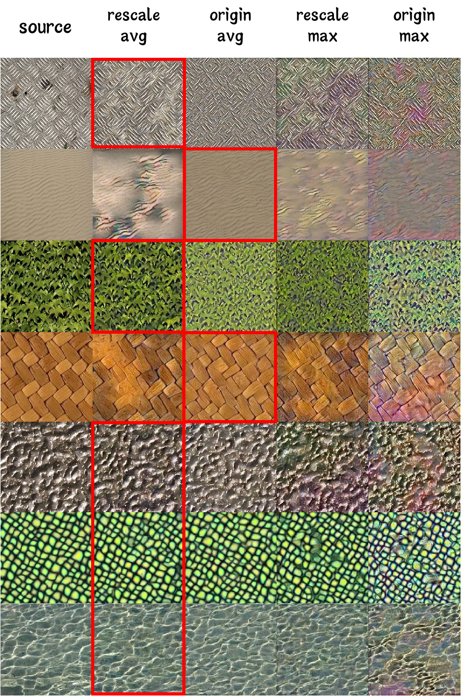
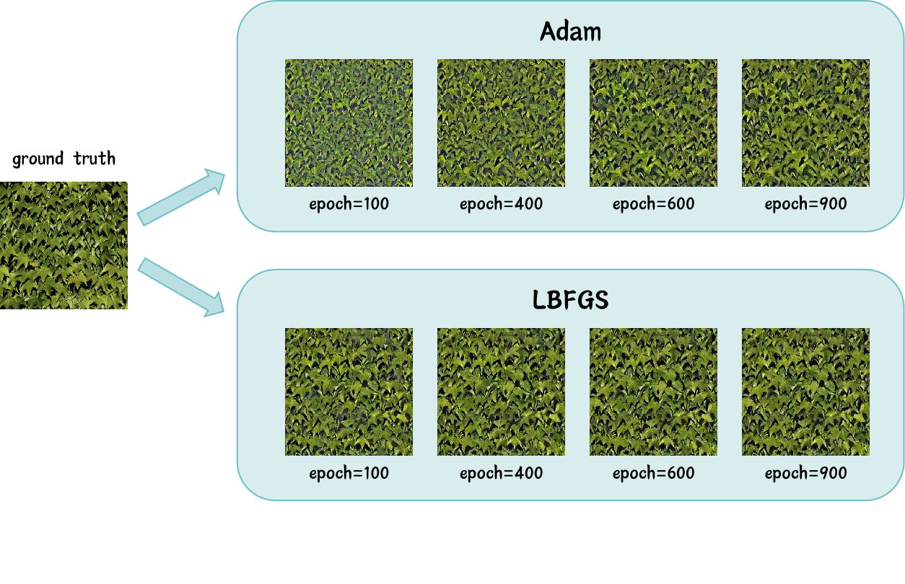

# Neural-Texture-Synthesis
This is a final team project for the Computer Vision course taught by Assistant Professor Pengshuai Wang in the fall term of 2023. The team memebers are Siyuan Yin, Shaoyang Cui, and Xiaohui Zhang.

The website of the tutorial is [Notion](https://fancy-icebreaker-99b.notion.site/Neural-Texture-Synthesis-fa7f4228679b49acb93836b3b6f45f6e).

We develop a general neural network model, based on the VGG19 architecture, capable of accurately describing and synthesizing a diverse array of textures. We make some modifications on model architecture and meticulously examine the effects of various pooling strategies, rescaling methods, and optimizers. We use gram matrix and mean square error(MSE) as loss function and use optimizer(Adam or LFBGS) to optimize synthesized image. We present a comprehensive series of experiments to illustrate these impacts.



## 1. Installation

The code has been tested on Windows 11 with python 3.9.12. 

1. create a virtual environment and activate it

```bash
conda create -n texture python=3.9
conda activate texture
```

2. install the required packages

```bash
pip install -r requirements.txt
```

3. Clone the repository

```bash
git clone https://github.com/Wanderings0/Neural-Texture-Synthesis.git
```

## 2. Usage

### 1. Model Definition

The model is defined in `VGG19.py`. The model is a VGG19 network with 16 convolutional layers and 5 pooling layers. The model is used to extract the feature maps of the input image and the style image. The feature maps are used to calculate the Gram matrix, which is used to calculate the MSE loss.

You can run the following code to see the model structure.

   ```bash
    python VGG19.py
   ```
    

 ### 2. Texture Synthesis

The texture synthesis is implemented in `texture_synthesis.py`. The file takes the following parameters:

| Argument            | Default Value                                  | Type  | Description                  |
|---------------------|------------------------------------------------|-------|------------------------------|
| `--model`           | `vgg19`                                        | `str` | model name                   |
| `--gt_path`         | `leaf.jpg`                                    | `str` | path to ground truth image   |
| `--pool`            | `avg`                                          | `str` | pooling method               |
| `--rescale`         | `True`                                         | `bool` | rescale weights or not       |
| `--optimizer`        | `Adam`                                         | `str` | optimize method              |
| `--epoch`           | `1000`                                         | `int` | epoch                        |
| `--lr`              | `0.05`                                         | `float` | learning rate               |
| `--device`          | `cuda:0`                                       | `str` | device                       |
| `--save_path`       | `result.jpg`                                   | `str` | save path                    |


We provide `leaf.img` as the ground truth image. You can run the following code to see the result of the texture synthesis. 
```bash
python texture_synthesis.py --gt_path leaf.jpg --pool avg --rescale True --optimizer Adam --save_path result.jpg
```
and
```bash
python texture_synthesis.py --gt_path leaf.jpg --pool avg --rescale True --optimizer LBFGS --save_path result.jpg
```

If your device has cuda, the first run with Adam is fast. The second run with LFBGS is slower.

The result should be like this:



HI there! This is **spidermonk7**, I'm also an author but just being lazy to upload files, so my files are also uploaded by my dude **Wanderings0**.
Just creating this to be a contributor!
Wish u all a good day. 
